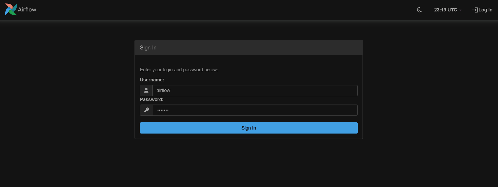
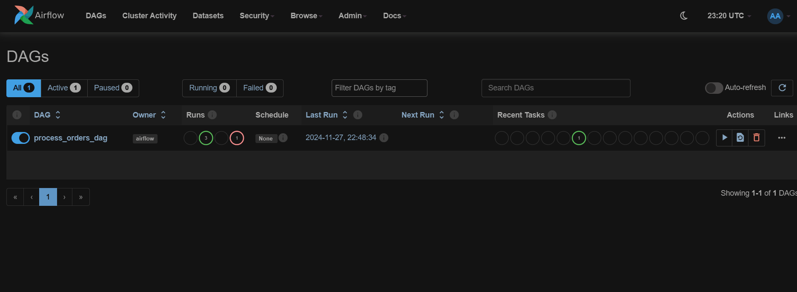
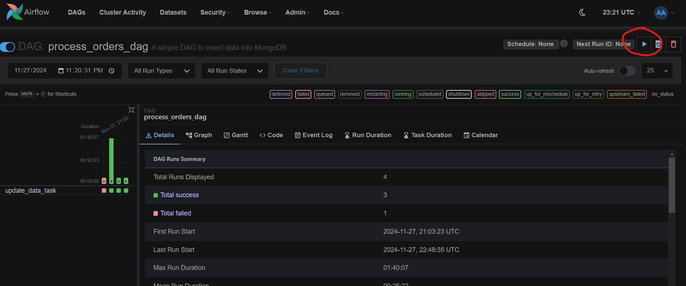

# Geo-Distributed-DBMS

## 1. Installation and Setup

Open docker desktop

Open command promt in the project foler

shell:-

    docker compose up
It will take up to 5 mins to compose up docker containers (do not close the shell)

shell:-
    
    docker build -t supplyone .
    docker run -it --rm supplyone

Once you enter the container shell run the main.py file
    
    python main.py

## 2. Trigger Airflow DAG

- Login Airflow at http://localhost:8080/

    

    Username: airflow

    Password: airflow

- Go to DAGs

    

- Click on "Trigger DAG" button located on the top-right corner for "process_orders_dag"

    

## 3. Run Queries
